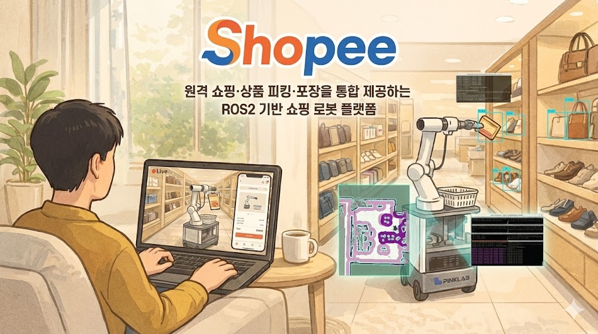
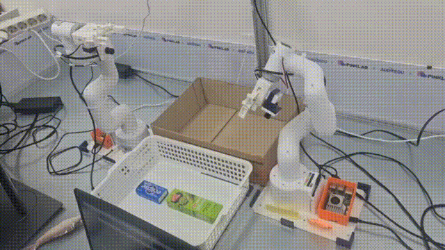
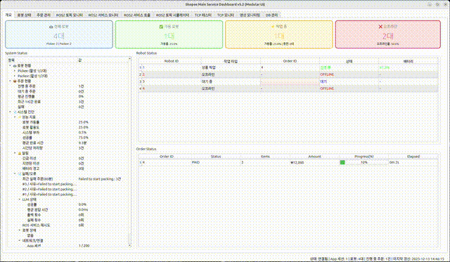
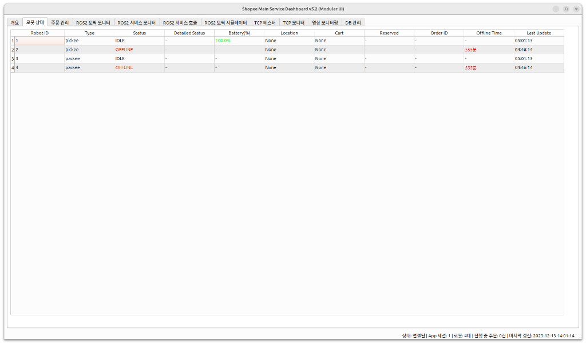
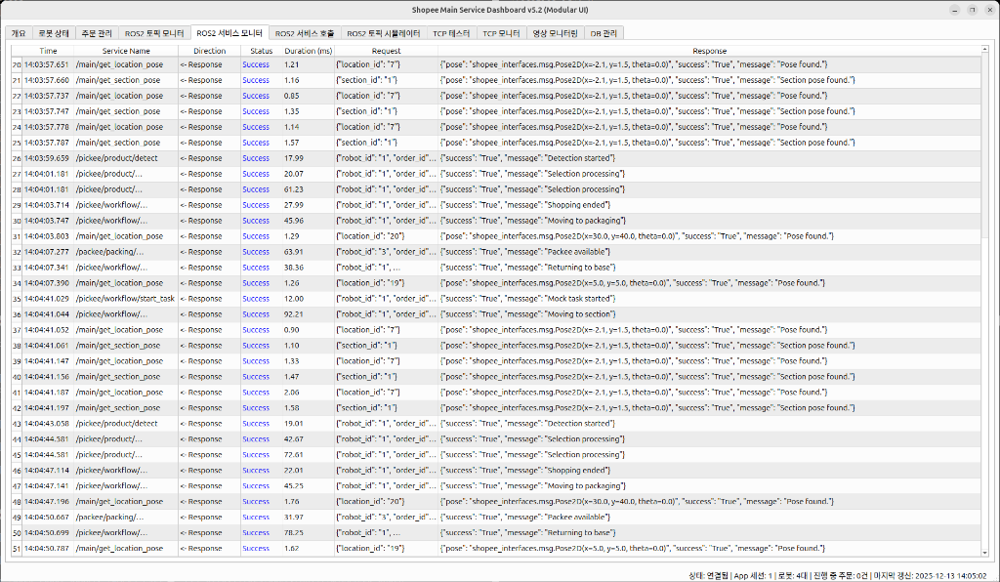
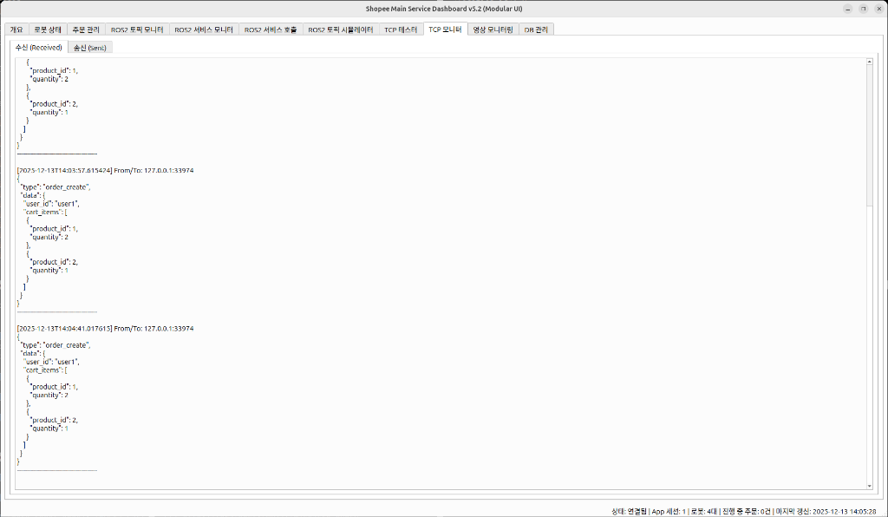
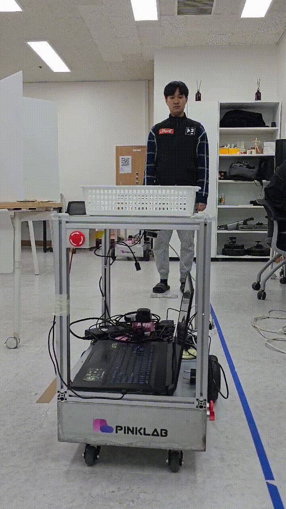
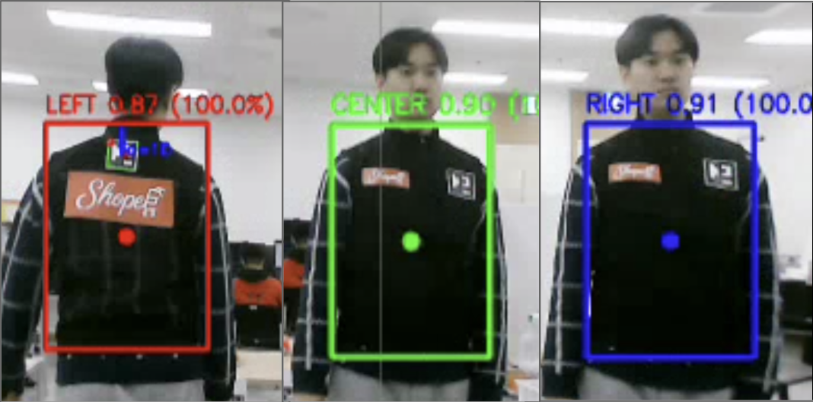

<p align="center">
  
</p>

<p align="center">
  <a href="https://docs.google.com/presentation/d/1-Q_TZLXfFrFoZFN47uKtgcyI_h5BXLpoyHWAMogy4Dw/edit?slide=id.p#slide=id.p">
    
  </a>
  <a href="LICENSE">
    
  </a>
</p>

# 📚 Table of Contents

> 📄 Korean version: [`README.md`](README.md)
- [1. Team Introduction](#1-team-introduction)
- [2. Project Overview](#2-project-overview)
- [3. Key Features](#3-key-features)
- [4. Core Technology](#4-core-technology)
- [5. Technical Challenges & Solutions](#5-technical-challenges--solutions)
- [6. System Design & Documentation](#6-system-design--documentation)
- [7. Project Structure](#7-project-structure)
- [8. Tech Stack](#8-tech-stack)
- [9. Execution & Development Guide](#9-execution--development-guide)
- [10. Project Management](#10-project-management)
- [11. License](#11-license)

---

# 1. Team Introduction
<div align="center">
  <table>
    <tr>
      <th width="15%">Team</th>
      <th width="15%">Name</th>
      <th width="70%">Role & Responsibility</th>
    </tr>
    <tr>
      <td align="center"><b>Main</b></td>
      <td align="center">Jang Jinhyuk</td>
      <td><b>Technical Lead</b>, Entire System & Communication Interface Design, Main Server (Backend) Implementation, Control System Design & Implementation</td>
    </tr>
    <tr>
      <td align="center"><b>App</b></td>
      <td align="center">Kim Yoonjae</td>
      <td>GUI, QT/PySide6</td>
    </tr>
    <tr>
      <td align="center"><b>LLM</b></td>
      <td align="center">Kim Jaehyung</td>
      <td>STT, TTS, LLM, VLA</td>
    </tr>
    <tr>
      <td align="center" rowspan="4"><b>Pickee</b><br>(Mobile + Picking)</td>
      <td align="center">Choi Wonho</td>
      <td>SLAM, Nav2, Staff Training, Person Following</td>
    </tr>
    <tr>
      <td align="center">Lim Eojin</td>
      <td>ArUco Detection, Precision Parking, PD Control</td>
    </tr>
    <tr>
      <td align="center">Lee Seunghan</td>
      <td>YOLO, CNN, Data Labeling, IBVS Control, PID Control</td>
    </tr>
    <tr>
      <td align="center">Ryu Hyejin</td>
      <td>Arm Control, CNN, Data Labeling, IBVS Control, PID Control</td>
    </tr>
    <tr>
      <td align="center" rowspan="3"><b>Packee</b><br>(Packing)</td>
      <td align="center">Song Wonjun</td>
      <td>C++ ROS2, Dual Arm Control, CNN Model Creation/Training, IBVS</td>
    </tr>
    <tr>
      <td align="center">Lee Hansu</td>
      <td>Object Detection, BPP (Bin Packing Problem), MoveIt, MTC</td>
    </tr>
    <tr>
      <td align="center">Park Daejun</td>
      <td>Dataset Construction & Arm Management</td>
    </tr>
  </table>
</div>

---

# 2. Project Overview

<div align="center">
  <table>
    <tr>
      <td align="center">
        <br>
        <sub>Remote Robot Shopping & Auto Picking</sub>
      </td>
      <td align="center">
        <br>
        <sub>Unmanned Automated Packing Service</sub>
      </td>
      <td align="center">
        <br>
        <sub>AI Partner & Smart Staff Assistant</sub>
      </td>
      <td align="center">
        <br>
        <sub>Real-time Integrated Control System</sub>
      </td>
    </tr>
  </table>
</div>

- **Project Purpose**
  - Automate and remotely control the in-store shopping process using apps and robots. This provides customers with a real-time selection and monitoring experience, while streamlining picking and packing operations for store management.
- **Project Duration**
  - 2025.09.10 ~ 2025.11.18 (10 Weeks, Sprint 1~10)

---

# 3. Key Features

## 3-1. Remote Shopping & Picking

<p align="center">
  
  <br>
  <sub>Remote Shopping & Picking Demo</sub>
</p>

<div align="center">
<table>
  <tr>
    <th style="width:18%">Key Steps</th>
    <th style="width:60%">Description</th>
  </tr>
  <tr>
    <td valign="top">Item Selection</td>
    <td valign="top">The customer selects items and places an order via the Shopee App/Video stream.</td>
  </tr>
  <tr>
    <td valign="top">Moving to Shelf</td>
    <td valign="top">Pickee moves to the shelf using Nav2, avoiding obstacles along the way.</td>
  </tr>
  <tr>
    <td valign="top">Picking Item</td>
    <td valign="top">Using vision/arm control, Pickee grabs the item, places it in the basket, and reports completion.</td>
  </tr>
</table>
</div>


## 3-2. Packing Scenario

<p align="center">
  
  <br>
  <sub>Automated Packing Demo</sub>
</p>

<div align="center">
<table>
  <tr>
    <th style="width:18%">Key Steps</th>
    <th style="width:60%">Description</th>
  </tr>
  <tr>
    <td valign="top">Moving to Packing Station</td>
    <td valign="top">Pickee moves to the packing station and exchanges the basket with Packee.</td>
  </tr>
  <tr>
    <td valign="top">Basket Exchange</td>
    <td valign="top">After verifying the basket status, Pickee signals Packee that it is ready for packing.</td>
  </tr>
  <tr>
    <td valign="top">Dual-Arm Packing</td>
    <td valign="top">Packee performs the packing sequence using its dual arms and reports the result.</td>
  </tr>
</table>
</div>


## 3-3. Admin Monitoring

<p align="center">
  
  <br>
  <sub>Real-time Monitoring Demo</sub>
</p>

<div align="center">
<table>
  <tr>
    <th style="width:18%">Key Features</th>
    <th style="width:60%">Description</th>
  </tr>
  <tr>
    <td valign="top">Dashboard</td>
    <td valign="top">Displays current tasks, number of robots, and 2D map locations in real-time.</td>
  </tr>
  <tr>
    <td valign="top">Robot Status</td>
    <td valign="top">View details like location, battery level, progress rate, and current task.</td>    
  </tr>
  <tr>
    <td valign="top">Inventory/Task History</td>
    <td valign="top">Supports inventory management and viewing of past task history.</td>
  </tr>
</table>

</div>

### 🖥️ Admin Dashboard Feature Examples (Main Service Dashboard)
**Modular UI-based Integrated Control System**
*(The dashboard provides various functions such as robot status, order management, and ROS2/TCP monitoring via tabs. Below are examples of some key features.)*

<div align="center">
<table>
  <tr>
    <td align="center" width="100%">
      <br>
      <b>1. Integrated Robot Status Monitoring</b>
    </td>
  </tr>
  <tr>
    <td>
      <ul>
        <li><b>Real-time Connection Status</b>: Monitors Online/Offline/IDLE status of all Pickee/Packee robots based on Heartbeat.</li>
        <li><b>Status/Location Info</b>: Checks battery level, current location (navigation coordinates), and basket attachment status at a glance.</li>
        <li><b>Task Tracking</b>: Tracks assigned Order ID and last communication time to immediately detect system freezing or deviation.</li>
      </ul>
    </td>
  </tr>
</table>

<table>
  <tr>
    <td align="center" width="50%">
      <br>
      <b>2. Deep Analysis of ROS2 Services/Topics</b>
    </td>
    <td align="center" width="50%">
      <br>
      <b>3. TCP/IP Data Packet Debugging</b>
    </td>
  </tr>
  <tr>
    <td valign="top">
      <ul>
        <li><b>Service Call History</b>: Records Request/Response and Latency of key logic like <code>get_location_pose</code>, <code>workflow</code>.</li>
        <li><b>Real-time Debugging</b>: Instantly captures Error Messages upon service failure to support remote debugging.</li>
      </ul>
    </td>
    <td valign="top">
      <ul>
        <li><b>JSON Packet Monitoring</b>: Captures low-level JSON packets (e.g., <code>order_create</code>) exchanged between App-Server-Robot.</li>
        <li><b>Data Integrity Verification</b>: Verifies schema consistency of transmitted/received data in real-time to ensure communication reliability.</li>
      </ul>
    </td>
  </tr>
</table>
</div>

## 3-4. Staff Assistance (Night/Restocking)

<p align="center">
  
  
  <br>
  <sub>Staff Following & Assistance Demo</sub>
</p>

<div align="center">
<table>
  <tr>
    <th style="width:18%">Key Features</th>
    <th style="width:60%">Description</th>
  </tr>
  <tr>
    <td valign="top">Mode Start</td>
    <td valign="top">Activates night mode and assistant functions.</td>
  </tr>
  <tr>
    <td valign="top">Following</td>
    <td valign="top">LLM interprets voice commands to switch to follow mode and track the staff member.</td>
  </tr>
  <tr>
    <td valign="top">Voice Navigation</td>
    <td valign="top">Extracts location commands to publish navigation topics, moving the robot to the specified location via Nav2.</td>
  </tr>
</table>
</div>


---

# 4. Core Technology

## 4-1. Autonomous Driving & Precision Parking (Pickee Mobile)

<div align="center">
  <table>
    <tr>
      <td align="center">
        <br>
        <sub>Precision Parking Logic</sub>
      </td>
      <td align="center">
        <br>
        <sub>ArUco Preprocessing (Grayscale)</sub>
      </td>
    </tr>
  </table>
</div>

- **Nav2-based Autonomous Driving**: Path planning and obstacle avoidance to the destination. Safety is ensured by dynamically controlling speed based on situations (obstacles, precision approach) via the `vel_modifier` node subscribing to Nav2's `/cmd_vel`.
- **ArUco Marker Precision Parking**: After arriving via Nav2, the robot recognizes ArUco markers attached to the shelf for precise position correction.
    - **Image Preprocessing**: Fallback to Grayscale conversion and binarization if RGB recognition fails, improving recognition rates.
    - **RTR Maneuver**: Performs a Rotate-Translate-Rotate pattern to align precisely with the marker, minimizing errors.

## 4-2. Robot Arm Control & Calibration (Robot Arm)

<div align="center">
  <table>
    <tr>
      <td align="center">
        <br>
        <sub>Two-Stream Network Pose Estimation</sub>
      </td>
      <td align="center">
        <br>
        <sub>Coordinate Calibration & PD Control</sub>
      </td>
    </tr>
  </table>
</div>

- **Visual Servoing**: Control method utilizing a Two-Stream Network to minimize the difference between the target image and the current real-time image.
- **Coordinate Calibration & PD Control**: Since the mobile robot (Cart) stops at slightly variable positions, the error between the trained model's target coordinates and the actual coordinates is calculated and compensated in real-time. Gaussian-based velocity profiles are applied to minimize vibration.

## 4-3. AI & LLM (Vision/Voice)

<div align="center">
  <table>
    <tr>
      <td align="center">
        <br>
        <sub>YOLOv11-based Item Recognition</sub>
      </td>
      <td align="center">
        <br>
        <sub>PoseCNN 6D Pose Estimation</sub>
      </td>
    </tr>
  </table>
</div>

- **Object Detection (Vision)**: Uses YOLOv11 model for precise detection of 18 types of items and obstacles. PoseCNN estimates the object's 6D Pose (position + orientation) to generate gripping coordinates for the robot arm.
- **Voice Recognition & Interaction (LLM)**: Whisper STT for accurate speech recognition even in noisy environments. Qwen model fine-tuned (SFT) with QLoRA to extract accurate locations/intents even from vague commands like "Go to the snack corner," preventing hallucinations.


---

# 5. Technical Challenges & Solutions

## 5-1. Unstable ArUco Marker Recognition (Precision Parking)

<div align="center">
  <table>
    <tr>
      <td align="center">
        <br>
        <sub>RGB Original (Failed)</sub>
      </td>
      <td align="center">
        <br>
        <sub>Grayscale + Binarization (Success)</sub>
      </td>
    </tr>
  </table>
</div>

- **Problem**: RGB camera failed to recognize markers depending on lighting or angle, causing precision parking failures.
- **Solution**: Added a fallback logic performing **Grayscale conversion and Binarization preprocessing** upon recognition failure. This significantly improved marker recognition by increasing contrast.

## 5-2. Robot Arm Picking Error & Jittering

<div align="center">
  <table>
    <tr>
      <td align="center">
        <br>
        <sub>Position Error of Mobile Robot</sub>
      </td>
      <td align="center">
        <br>
        <sub>Coordinate Difference Calculation & Correction</sub>
      </td>
    </tr>
  </table>
</div>

- **Problem**: Since the robot (Cart) stops at slightly different positions each time, using fixed training coordinates caused picking misalignment. Fine jittering occurred at the arm's end.
- **Solution**:
    1. **Real-time Calibration**: Dynamically corrected target coordinates by calculating the difference (Current Robot Coord - Trained Robot Coord).
    2. **PD Control**: Applied Gaussian-based acceleration profiles to induce smooth deceleration, minimizing jitter.

## 5-3. LLM Hallucination (Voice Navigation)

- **Problem**: Base LLM models hallucinated when processing vague location commands like "snack corner," returning non-existent coordinates or irrelevant places.
- **Solution**: Constructed a specialized dataset of **527 entries** related to location movement and performed **QLoRA SFT (Fine-tuning)**.

| Category | User Utterance | LLM Response (Action) | Result |
| :---: | :--- | :--- | :---: |
| **Before** | "Go to snacks" | "Okay, are you going to eat snacks?" (Chit-chat) | ❌ Fail |
| **After** | "Go to snacks" | `{"action": "move", "target": "snack_corner"}` | ✅ Success |

## 5-4. Limitations of Dynamic Speed Control

- **Problem**: Nav2's default settings made it difficult to decelerate or stop immediately and naturally when detecting people or obstacles.
- **Solution**: Developed a **`vel_modifier` node** that intercepts the `/cmd_vel` topic. Injected logic to linearly decelerate or forcibly stop the robot based on obstacle distance or precision parking stage.

## 5-5. Staff Recognition & Following (Person Tracking)

<p align="center">
  
  <br>
  <sub>Shopee Uniform YOLO Training Data & Detection Result</sub>
</p>

- **Problem**: Generic Person Detection models could not distinguish between customers and staff, causing the robot to follow customers incorrectly.
- **Solution**: Constructed a custom dataset for **Staff Uniforms** with the Shopee logo and fine-tuned YOLO. Improved to detect and follow only specific Staff members.

---

# 6. System Design & Documentation

## 6-1. SW Architecture
<div align="center">
  
</div>

## 6-2. HW Architecture
<div align="center">
  
</div>

## 6-3. Service Flow
<div align="center">
  <table>
    <tr>
      <td align="center">
        <br>
        <sub>Daytime (During Business Hours)</sub>
      </td>
    </tr>
    <tr>
      <td align="center">
        <br>
        <sub>Nighttime (After Business Hours)</sub>
      </td>
    </tr>
  </table>
</div>
<br>

## 6-4. State Diagram
<div align="center">
  
</div>

## 6-5. Sequence Diagram
<details>
<summary> SC01: Item Order</summary>
SC-01-01: Login


SC-01-02: Item Search


SC-01-03: Payment


</details>
<details>
<summary> SC02: Shopping</summary>
SC-02-01: Moving to Shelf


SC-02-02: Obstacle Avoidance


SC-02-03: Shelf Item Selection


SC-02-04: Adding Item to Basket


SC-02-05: Shopping Check-out


</details>
<details>
<summary> SC03: Item Packaging</summary>
SC-03-01: Moving to Packing Station


SC-03-02: Basket Exchange


SC-03-03: Packee Readiness Check


SC-03-04: Item Packing


</details>
<details>
<summary> SC04: Return & Charge</summary>


</details>
<details>
<summary> SC05: Admin Functions</summary>
SC-05-01: Admin Monitoring

Robot Info Display


Robot Location Display


Robot View Check


Robot View Termination


Robot Status Inquiry


Progress Check


SC-05-02: Admin Inventory Management

Inventory Info Inquiry


Inventory Info Modification


Inventory Info Addition


Inventory Info Deletion


SC-05-03: Admin Task History Inquiry


</details>
<details>
<summary> SC06: Staff Assistant Functions</summary>
SC-06-01: Mode Start


SC-06-02: Recognition & Following


SC-06-03: Voice Command


SC-06-04: Destination Movement


SC-06-05: Mission Completion Check


</details>

## 6-6. ERD
<div align="center">
  
</div>

## 6-7. Interface Specification

<details>
<summary> TCP Communication</summary>

| Function | From | To | Message Type | Schema |
|---------|------|----|--------------|--------|
| User Login Request | App | Main Service | user_login | ```json { "type": "user_login", "data": { "user_id": "string", "password": "string" } }``` |
(Table content omitted - Refer to InterfaceSpecification/App_vs_Main.md for full details)

*For details, refer to the [Interface Specification Document](docs/InterfaceSpecification).*
</details>

<details>
<summary> UDP Communication</summary>

#### Protocol
| Item | Content |
|------|------|
| Port | 6000 |
| Protocol | UDP |
| Data Format | JSON (Metadata) + Binary (Image Data) |
| Max Packet Size | 1,600 bytes |

#### Packet Structure
[ JSON Header (≈200 bytes) ] + [ Binary Image Data (max 1,400 bytes) ]
</details>

<details>
<summary> HTTP Communication (LLM)</summary>

| Function | Endpoint | Request | Response |
|---|---|---|---|
| Item Search Query | GET /llm/search_query | `{"text": "Find apples"}` | `{"sql_query": "name LIKE '%apples%'"}` |
| Intent Detection | GET /llm/intent_detection | `{"text": "Pickee, come here"}` | `{"intent": "Move_place", ...}` |

</details>

<details>
<summary> ROS2 Communication</summary>

### Main <-> Pic Main
| Function | Topic | Message Type | From | To |
|---|---|---|---|---|
| Move Start Notification | /pickee/moving_status | PickeeMoveStatus | Pic Main | Main |
| Arrival Report | /pickee/arrival_notice | PickeeArrival | Pic Main | Main |
| Robot Status | /pickee/robot_status | PickeeRobotStatus | Pic Main | Main |
| Task Start Command | /pickee/workflow/start_task | PickeeWorkflowStartTask (Srv) | Main | Pic Main |

### Pic Main <-> Pic Vision
| Function | Topic | Message Type |
|---|---|---|
| Shelf Item Detection | /pickee/vision/detection_result | PickeeVisionDetection |
| Obstacle Detection | /pickee/vision/obstacle_detected | PickeeVisionObstacles |

### Pic Main <-> Pac Main
| Function | Topic | Message Type |
|---|---|---|
| Packing Complete | /packee/packing_complete | PackeePackingComplete |
| Availability Check | /packee/packing/check_availability | PackeePackingCheckAvailability (Srv) |

</details>

---

# 7. Project Structure
```
Shopee/
├── README.md                # Shopee Overview (Korean Main)
├── README.en.md             # Shopee Overview (English Backup)
├── shopee_ros2/             # ROS2 Workspace (Navigation, Arm, Vision, Main, App, Interfaces)
├── shopee_llm/              # LLM/STT Training & Serving Resources
├── docs/                    # Requirements, Design, Interface, Diagrams, Coding Standards
├── assets/                  # Banners, Images, GIFs
└── AGENTS.md                # Agent Instructions
```

---

# 8. Tech Stack

| Category | Technology |
|------|-----------|
| **OS / Platform** | [](https://ubuntu.com/) [](https://docs.ros.org/en/humble/) |
| **Language** | [](https://www.python.org/) [](https://isocpp.org/) |
| **AI / LLM** | [](https://github.com/ultralytics/ultralytics)    |
| **Robotics** | [](https://navigation.ros.org/) [](https://moveit.ros.org/) [](https://opencv.org/)  |
| **DB / Server** | [](https://www.mysql.com/) [](https://fastapi.tiangolo.com/)  |
| **Tools** | [](https://git-scm.com/) [](https://www.atlassian.com/software/jira) [](https://www.atlassian.com/software/confluence) [](https://slack.com/) [-41CD52?style=for-the-badge&logo=qt&logoColor=white)](https://www.qt.io/) |

---

# 9. Execution & Development Guide
- For build/run/test instructions of the ROS2 workspace, refer to `shopee_ros2/README.md`.
  ```bash
  cd shopee_ros2
  rosdep install --from-paths src --ignore-src -r -y
  colcon build
  source install/setup.bash
  ```
- Detailed guides for each package can be found in `shopee_ros2/src/<package>/README.md`.
- Coding Standards: `docs/CodingStandard/standard.md` (Please follow ROS2/Python/C++ naming & commenting conventions).

---

# 10. Project Management

## 1. Project Schedule Management (Jira)

<table>
  <tr>
    <td align="center" width="400" valign="top">
      
    </td>
    <td align="left" valign="top">
      ▪ <b>Total 10 Weeks (2024.09.10 ~ 2024.11.18)</b><br>
      ▪ <b>Sprint 1</b>: Topic Selection / Planning / Requirements Definition<br>
      ▪ <b>Sprint 2~4</b>: Design / Tech Research<br>
      ▪ <b>Sprint 5</b>: Communication Implementation<br>
      ▪ <b>Sprint 6~9</b>: Feature Implementation & Integration Testing<br>
      ▪ <b>Sprint 10</b>: Presentation Materials
    </td>
  </tr>
</table>

## 2. Project Document Management (Confluence)

<table>
  <tr>
    <td align="center" width="400" valign="top">
      
    </td>
    <td align="left" valign="top">
      ▪ <b>Confluence Document Management</b><br>
      ▪ Integrated management of project deliverables such as planning docs, design docs, and meeting minutes<br>
      ▪ Recording knowledge sharing and troubleshooting items among team members
    </td>
  </tr>
</table>

---

# 11. License

This project is open-sourced under the [Apache License 2.0](LICENSE).
For details, please refer to the [`LICENSE`](LICENSE) file.
